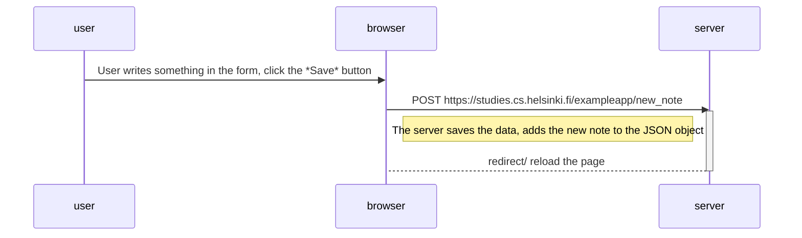

```mermaid
sequenceDiagram
    participant user
    participant browser
    participant server


    user->>browser: User writes something in the form, click the *Save* button
    
    browser->>server: POST https://studies.cs.helsinki.fi/exampleapp/new_note
    activate server

    Note left of server: The server saves the data, adds the new note to the JSON object

    server-->browser: redirect/ reload the page
    deactivate server
```
