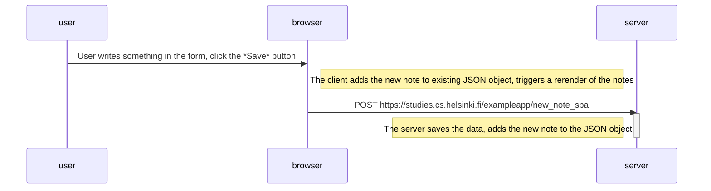

```mermaid
sequenceDiagram
    participant user
    participant browser
    participant server


    user->>browser: User writes something in the form, click the *Save* button
    Note right of browser: The client adds the new note to existing JSON object, triggers a rerender of the notes

    browser->>server: POST https://studies.cs.helsinki.fi/exampleapp/new_note_spa
    activate server
    Note left of server: The server saves the data, adds the new note to the JSON object
    deactivate server
```
